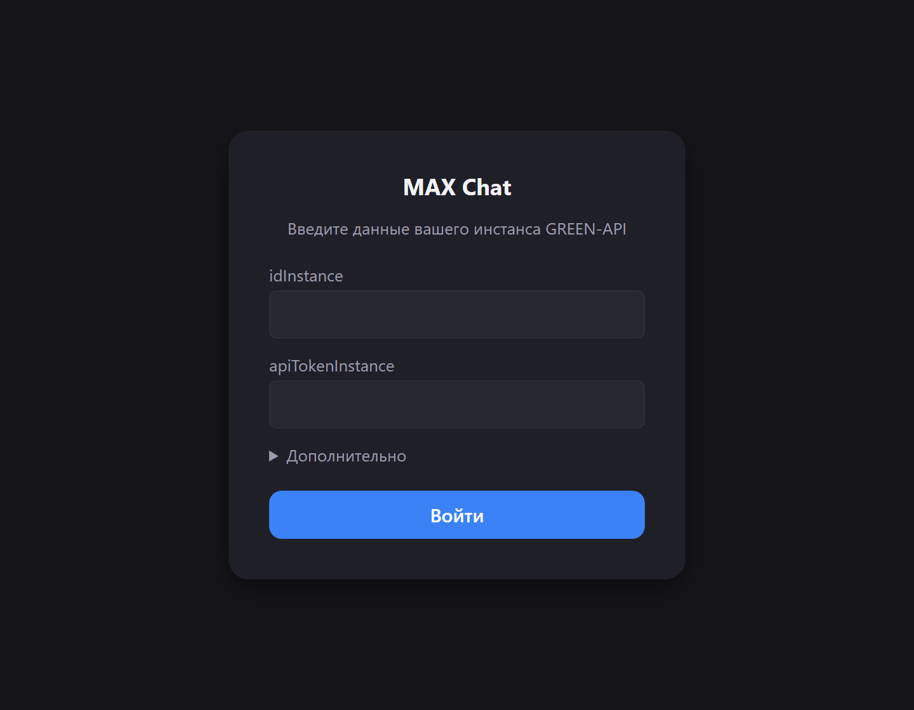
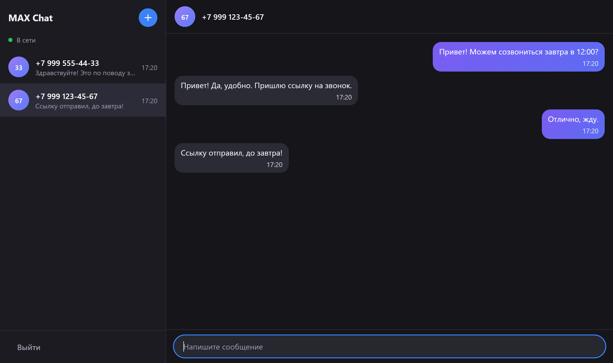

# MAX Chat

Простой веб-чат для отправки и получения текстовых сообщений в мессенджере MAX через [GREEN-API](https://green-api.com/max). Внешний вид ориентирован на web.max.ru.

Демо: https://tw1nk1e.github.io/max-chat/

## Скриншоты





## Что умеет

- Вход по `idInstance` и `apiTokenInstance` из личного кабинета GREEN-API, с проверкой, что инстанс авторизован.
- Создание чата по номеру телефона (РФ и РБ, любой формат ввода).
- Отправка текстовых сообщений: Enter отправляет, Shift+Enter переносит строку, при ошибке есть кнопка «Повторить».
- Получение ответов в реальном времени, даже от номеров, для которых чата ещё нет.
- История переписки сохраняется в браузере отдельно для каждого инстанса.
- Адаптивная вёрстка: на узком экране показывается либо список чатов, либо переписка.

Медиа, группы, реакции, статусы прочтения и поиск в проект не входят.

## Как получить данные для входа

1. Установите приложение MAX и зарегистрируйтесь в личном кабинете GREEN-API (ссылка есть на странице https://green-api.com/max).
2. Создайте инстанс и авторизуйте его: в приложении MAX откройте «Профиль - Устройства - Войти по QR-коду» и отсканируйте QR-код из кабинета.
3. На странице инстанса возьмите три значения:
   - `idInstance`
   - `apiTokenInstance`
   - `apiUrl` (у каждого инстанса свой хост, например `https://3100.api.green-api.com`). В форме входа это поле спрятано в разделе «Дополнительно».

### Настройки инстанса

Чтобы ответы приходили в чат, в кабинете (или методом `SetSettings`) нужно:

- оставить пустым `webhookUrl`, иначе получение через HTTP API не работает;
- включить уведомления о входящих сообщениях (`incomingWebhook`);
- по желанию включить уведомления о сообщениях, отправленных с телефона и через API (`outgoingMessageWebhook`, `outgoingAPIMessageWebhook`), тогда они тоже появятся в чате.

Если задан `webhookUrl`, GREEN-API отвечает ошибкой на получение сообщений, и под индикатором соединения в списке чатов появляется подсказка.

## Запуск локально

Нужен Node.js 20 или новее (версия указана в `.nvmrc`).

```
npm ci
npm run dev
```

Приложение откроется на http://localhost:5173. Бэкенд не нужен: запросы идут из браузера напрямую в GREEN-API.

Если `npm install` падает с ошибкой `Cannot read properties of null (reading 'edgesOut')`, это баг npm 10.9. Используйте `npm ci` или добавьте `--legacy-peer-deps`.

### Скрипты

- `npm run dev` - запуск в режиме разработки
- `npm run build` - сборка
- `npm run preview` - просмотр сборки
- `npm run lint` - ESLint
- `npm run typecheck` - проверка типов
- `npm run test` - тесты
- `npm run test:watch` - тесты в режиме наблюдения
- `npm run format` - форматирование Prettier

## Стек

Vite, React 18, TypeScript (strict), Zustand, TanStack Query (только для отправки сообщений), CSS Modules, Vitest, Testing Library, MSW, ESLint и Prettier. Деплой на GitHub Pages через GitHub Actions.

## Архитектура

Структура по слоям в духе Feature-Sliced Design, импорты идут только сверху вниз:

```
src/
  app/        корневой компонент, провайдеры, глобальные стили
  pages/      экраны: login и chat
  widgets/    список чатов и окно переписки
  features/   auth, create-chat, send-message, receive-messages
  entities/   session и chat (сторы)
  shared/     клиент GREEN-API, утилиты, базовые UI-компоненты
```

Роутера нет: два экрана переключаются по наличию сессии. Заметки по API GREEN-API для MAX лежат в [src/shared/api/README.md](src/shared/api/README.md).

### Как работает получение сообщений

Уведомления забираются по HTTP API как очередь: один строго последовательный цикл `ReceiveNotification`, обработка, `DeleteNotification`. Уведомление удаляется всегда, даже ненужного типа. При сетевых ошибках пауза растёт от 1 до 30 секунд, после успеха сбрасывается. Цикл запускается после входа и останавливается при выходе. Повторы отсекаются по `idMessage`.

### Как создаётся чат

`chatId` в MAX назначает сервер и он не выводится из номера телефона. Поэтому при создании чата вызывается `CheckAccount`, а дальше везде используется полученный `chatId`. Это же значение приходит в входящих уведомлениях, так ответы попадают в нужный чат.

## Хранение данных

- Учётные данные лежат в `sessionStorage` и стираются при выходе или закрытии вкладки.
- История переписки лежит в `localStorage` под ключом с `idInstance` и остаётся после выхода. При повторном входе в тот же инстанс переписка возвращается. Историю с сервера приложение не подтягивает.

## Известные ограничения

- Работают только номера РФ (`+7`) и РБ (`+375`): так устроены `CheckAccount` и отправка в GREEN-API.
- Только личные текстовые сообщения. Группы, файлы и прочие типы уведомлений игнорируются (но удаляются из очереди).
- На тарифе Developer доступно 3 чата и 100 проверок номеров, при частых проверках MAX может ограничить аккаунт.
- Сообщения, пришедшие, пока сайт был закрыт, приложение получит при следующем открытии, но не позже чем через 24 часа: столько GREEN-API хранит очередь.
- Токен хранится в браузере на время сессии и передаётся в адресе запроса, как этого требует GREEN-API. Не используйте приложение на чужих устройствах.
- Отправленное сообщение считается доставленным, когда GREEN-API принял его в очередь. Статусы доставки и прочтения не отслеживаются.
